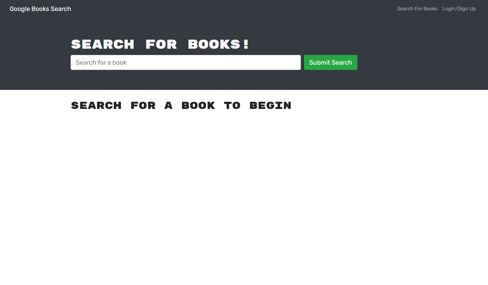
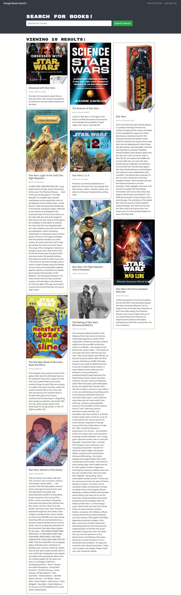

# Feeling-Yo-Shelf-BookSearch

## Description

Google Books API built with a restful API, and refactored to be a GraphQL API built with Apollo Server. The app was built using the MERN stack with a React front end, MongoDB database, and Node.js/Express.js server and API.

## Table of Contents

1. [Installation](#installation)
2. [Usage](#usage)
3. [Contributers](#contributers)
4. [Screen Shots](#screenshots)

## Installation

Run `npm i` to install dependencies, run `npm run build` and lastly, `run npm run develop` to automatically open the application in your browser.  Or run with Heroku with link displayed below.

## Usage

A user can search for any book and add it to their list! Keep track of books the user has read, books to read or buy, and/or delete them from the list if the user decides to.

## Contributers

Jordi Hernandez

## Screenshots

### GitHub/Heroku

[GitHub](https://github.com/hernajor133/Feeling-Yo-Shelf-BookSearch)
[Heroku](https://feeling-yo-shelf-booksearch.herokuapp.com/)
